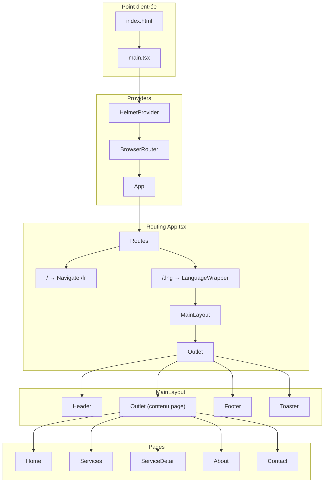

Guide d'architecture, structure des dossiers, utilisation et syntaxe des composants.

> **Modèle réutilisable** : Cette architecture sert de référence pour les futurs projets. Voir [MODELE_ARCHITECTURE.md](./MODELE_ARCHITECTURE.md) pour le modèle condensé à réutiliser.

---

## 1. Vue d'ensemble

**TypeScript** et **Vite**. Le site est multilingue (FR/EN) avec des routes préfixées par la langue (`/fr`, `/en`).

### Stack technique

| Couche | Technologie |
|--------|-------------|
| Build | Vite |
| UI | React  TypeScript |
| Routing | React Router DOM v7 |
| i18n | i18next + react-i18next |
| Styling | Tailwind CSS |
| Composants UI | Radix UI (40+ primitives) |
| Animations | Motion |
| Icônes | Lucide React |
| Formulaires | react-hook-form |
| SEO | react-helmet-async |
| Notifications | Sonner |

**Alias de chemin** : `@/` pointe vers `./src/`

---

## 2. Structure des dossiers

### Règle générale : où mettre quoi ?

| Dossier | Contenu | Exemple |
|---------|---------|---------|
| `src/pages/` | Une page = une route. Assemble des sections. | `Home.tsx`, `About.tsx` |
| `src/components/sections/` | Blocs réutilisables par page/feature, organisés par domaine | `About/TeamSection.tsx`, `Home/Stats.tsx` |
| `src/components/` (racine) | Composants partagés entre plusieurs pages | `Hero.tsx`, `PageHero.tsx`, `SEO.tsx` |
| `src/components/ui/` | Primitives UI (Radix) réutilisables | `button.tsx`, `card.tsx`, `dialog.tsx` |
| `src/layouts/` | Structure commune (Header, Footer, Outlet) | `MainLayout.tsx`, `Header.tsx` |
| `src/assets/` | Images, logos | `logo-ibs.png`, `agent5.png` |
| `src/styles/` | Variables CSS, styles globaux | `globals.css` |

### Arborescence détaillée

```
src/
├── main.tsx              # Point d'entrée (createRoot, providers)
├── App.tsx               # Définition des Routes
├── i18n.ts               # Traductions FR/EN (objet resources)
├── index.css             # Tailwind + variables
│
├── pages/                # 1 page = 1 route
│   ├── Home.tsx          # Route /
│   ├── About.tsx         # Route /about
│   ├── Services.tsx      # Route /services
│   ├── ServiceDetail.tsx # Route /service/:id
│   └── Contact.tsx       # Route /contact
│
├── layouts/
│   ├── MainLayout.tsx    # Header + <Outlet /> + Footer + Toaster
│   ├── Header.tsx        # Nav + sélecteur langue
│   └── Footer.tsx
│
├── components/
│   ├── sections/         # Sections par domaine
│   │   ├── Home/         # Hero, Stats, Solutions, Partners, News
│   │   ├── About/        # EnterpriseSection, VisionSection, InstallationsSection, TeamSection
│   │   ├── Services/     # ServicesGrid, VisionSummary, ProcessSection, GallerySection
│   │   └── Contact/      # ContactForm, ContactDetails, MapSection
│   │
│   ├── ui/               # 40+ composants Radix (button, card, input...)
│   │   ├── button.tsx
│   │   ├── utils.ts      # fonction cn() pour fusionner les classes
│   │   └── ...
│   │
│   ├── Hero.tsx          # Hero page d'accueil (spécifique)
│   ├── PageHero.tsx      # Hero réutilisable pour About, Services, etc.
│   ├── SEO.tsx           # Meta tags (react-helmet-async)
│   └── LanguageWrapper.tsx  # Valide :lng et sync i18n
│
├── assets/               # Images importées
└── styles/
    └── globals.css
```

### Convention de nommage

- **Pages** : PascalCase, singulier (`Home`, `About`, `Services`)
- **Sections** : PascalCase + suffixe `Section` (`TeamSection`, `EnterpriseSection`)
- **Composants UI** : camelCase pour les fichiers (`button.tsx`, `dropdown-menu.tsx`)

---

## 3. Routing et flux d'exécution

### Routes disponibles

| Route | Page |
|-------|------|
| `/` | Redirection vers `/fr` |
| `/:lng` | Home |
| `/:lng/services` | Liste des services |
| `/:lng/service/:id` | Détail d'un service |
| `/:lng/about` | À propos |
| `/:lng/contact` | Contact |

### Flux d'utilisation

```
App (Routes)
  └── LanguageWrapper (valide :lng)
        └── MainLayout (Header + Outlet + Footer)
              └── Page (ex: About)
                    └── PageHero + EnterpriseSection + VisionSection + TeamSection
```

### Diagramme Mermaid (flux d'exécution)



---

## 4. Internationalisation (i18n)

- **Langues** : Français (`fr`), Anglais (`en`), fallback `fr`
- **URL** : Toutes les routes sont sous `/:lng`
- **LanguageWrapper** (`src/components/LanguageWrapper.tsx`) :
  - Valide que `lng` est dans `['fr', 'en']`
  - Redirige vers `/fr` si invalide
  - Synchronise `i18n.changeLanguage(lng)` avec l'URL
- **Traductions** : Définies dans `src/i18n.ts` (nav, footer, contact, about, services)
- **Usage** : `useTranslation()` et `t('key')` dans les composants

---

## 5. Alias, navigation et résumé des actions

### Alias `@/` et chemins

- **Config** : `@/*` → `./src/*` dans `tsconfig.json` et `vite.config.ts`
- **Usage** : `import img from "@/assets/logo.png"` ou `import { Button } from "@/components/ui/button"`

### Navigation avec langue

- `getLocalizedPath('/about')` → `/{i18n.language}/about` (ex: `/fr/about`)
- `Link to={getLocalizedPath('/about')}` pour garder la langue dans l'URL
- `toggleLanguage()` dans le Header : change la langue et navigue vers la même page

### Résumé : où créer quoi ?

| Besoin | Action |
|--------|--------|
| Nouvelle page | Créer dans `pages/`, ajouter la route dans `App.tsx` |
| Nouvelle section | Créer dans `sections/{Domaine}/`, l'importer dans la page |
| Traduction | Ajouter la clé dans `i18n.ts`, utiliser `t('clé')` |
| Image | Importer depuis `@/assets/` |
| Composant UI réutilisable | Utiliser ou étendre `components/ui/` |
| Navigation avec langue | `Link to={getLocalizedPath('/path')}` |

---

## 6. Layout et composition

**MainLayout** (`src/layouts/MainLayout.tsx`) enveloppe toutes les pages :

- **Header** : navigation, sélecteur de langue
- **Outlet** : contenu de la page courante
- **Footer** : liens, infos
- **Toaster** : notifications Sonner

Chaque page assemble des sections depuis `components/sections/` et des composants partagés.

---

## 7. Styling et gestion d'état

### Styling

- **Tailwind CSS** : classes utilitaires
- **Variables CSS** : `--background`, `--foreground`, `--primary`, `--radius`, etc.
- **Dark mode** : via `next-themes` et classe `.dark`
- **Composants UI** : Radix + Tailwind (CVA, clsx, tailwind-merge)
- **Couleur principale** : `#41d2ff` (bleu)
- **Conteneur** : `container mx-auto px-6 md:px-12 lg:px-20`
- **Sections** : `py-24`, `bg-[#f8fafc]`

### Gestion d'état

- **Pas de store global** (pas de Redux, Zustand, etc.)
- **État local** : `useState` (ex. menu mobile dans Header)
- **Context** : uniquement pour certains composants Radix (carousel, toggle-group, etc.)
- **Formulaires** : `react-hook-form` (ex. ContactForm)

---

## 8. Syntaxe des composants

### Structure de base (export nommé + React.FC)

```tsx
import React from 'react';

export const NomDuComposant: React.FC = () => {
  return (
    <section>
      {/* contenu */}
    </section>
  );
};
```

- **Export nommé** : `export const` (jamais `export default`)
- **Typage** : `React.FC` = Function Component (composant fonctionnel)
- **Corps** : fonction fléchée qui retourne du JSX

### Typage des props

**Avec interface :**

```tsx
interface HeroProps {
  onNavigate: (page: string) => void;
}

export const Hero: React.FC<HeroProps> = ({ onNavigate }) => {
  return <button onClick={() => onNavigate('contact')}>Contact</button>;
};
```

**Props optionnelles avec valeurs par défaut :**

```tsx
interface SEOProps {
  title: string;
  description: string;
  keywords?: string;
  image?: string;
}

export const SEO: React.FC<SEOProps> = ({ 
  title, 
  description, 
  image = '/logo-ibs.png' 
}) => { ... };
```

**Props héritées d'un élément HTML (composants UI) :**

```tsx
function Card({ className, ...props }: React.ComponentProps<"div">) {
  return (
    <div className={cn("bg-card rounded-xl", className)} {...props} />
  );
}
```

### Sous-composants

**Défini avant le composant principal :**

```tsx
const AccordionItem = ({ title, content, isOpen, onClick }: {...}) => (
  <div>...</div>
);

export const EnterpriseSection: React.FC = () => {
  return (
    <section>
      {accordionData.map((item, idx) => (
        <AccordionItem key={idx} title={item.title} ... />
      ))}
    </section>
  );
};
```

**Défini après le composant principal :**

```tsx
export const Stats: React.FC = () => (
  <span><CountUp end={8398} duration={2000} /></span>
);

const CountUp: React.FC<{ end: number; duration: number }> = ({ end, duration }) => {
  const [count, setCount] = React.useState(0);
  return <span>{count.toLocaleString()}</span>;
};
```

### Composants UI : pattern "compound"

```tsx
function Card({ className, ...props }: React.ComponentProps<"div">) {
  return <div className={cn("...", className)} {...props} />;
}

function CardHeader({ className, ...props }: React.ComponentProps<"div">) {
  return <div className={cn("...", className)} {...props} />;
}

export { Card, CardHeader, CardTitle, CardContent, CardFooter };
```

**Usage :**

```tsx
import { Card, CardHeader, CardTitle } from "@/components/ui/card";

<Card>
  <CardHeader>
    <CardTitle>Titre</CardTitle>
  </CardHeader>
</Card>
```

### Hooks courants

```tsx
// État
const [openIndex, setOpenIndex] = useState<number | null>(0);

// i18n
const { t, i18n } = useTranslation();
t('about.title');
i18n.language;

// Router
const navigate = useNavigate();
const { lng, id } = useParams<{ lng: string; id?: string }>();
const location = useLocation();
```

### Patterns JSX

**Classes conditionnelles :**

```tsx
<span className={`text-2xl font-bold ${isOpen ? 'text-[#41d2ff]' : 'text-[#0f172b]'}`}>
```

**Rendu conditionnel :**

```tsx
{keywords && <meta name="keywords" content={keywords} />}

<AnimatePresence>
  {isOpen && (
    <motion.div initial={{ opacity: 0 }} animate={{ opacity: 1 }} exit={{ opacity: 0 }}>
      Contenu
    </motion.div>
  )}
</AnimatePresence>
```

**Boucle .map() :**

```tsx
{team.map((member, idx) => (
  <div key={idx}>
    <TeamCard {...member} />
  </div>
))}
```

**Détection de langue :**

```tsx
t('nav.fr') === 'Accueil' ? "Texte en français" : "Text in English"
```

### Structure d'une section typique

```tsx
export const NomSection: React.FC = () => {
  const { t } = useTranslation();
  const [state, setState] = useState(/* ... */);

  const items = [
    { title: t('about.xxx'), content: t('about.xxx_desc') },
  ];

  return (
    <section className="py-24 bg-white">
      <div className="container mx-auto px-6 md:px-12 lg:px-20">
        <div className="flex items-center gap-3 mb-4">
          <div className="w-10 h-1 bg-[#41d2ff] rounded-full" />
          <span className="text-[#41d2ff] font-bold text-xs uppercase tracking-[0.2em]">
            {t('about.label')}
          </span>
        </div>
        <h2 className="text-xl md:text-3xl font-bold text-[#0f172b] mb-12">
          {t('about.title')}
        </h2>

        <div className="grid grid-cols-1 lg:grid-cols-2 gap-20">
          {items.map((item, idx) => (
            <ItemCard key={idx} {...item} />
          ))}
        </div>
      </div>
    </section>
  );
};
```

### Animations (Motion)

```tsx
import { motion, AnimatePresence } from 'motion/react';

// Animation au scroll
<motion.div 
  initial={{ opacity: 0, y: 30 }}
  whileInView={{ opacity: 1, y: 0 }}
  viewport={{ once: true }}
  transition={{ duration: 0.8 }}
>

// Animation au hover
<motion.div whileHover={{ y: -10 }}>
```

### Composants UI : CVA + cn()

```tsx
const buttonVariants = cva(
  "inline-flex items-center ...",
  {
    variants: {
      variant: { default: "...", outline: "...", ghost: "..." },
      size: { default: "...", sm: "...", lg: "..." },
    },
    defaultVariants: { variant: "default", size: "default" },
  }
);

className={cn(buttonVariants({ variant, size, className }))}
```

---

## 9. Imports typiques par type de composant

| Type | Imports courants |
|------|------------------|
| Section | `React`, `motion`, `useTranslation`, `lucide-react` |
| Page | `useTranslation`, sections, `PageHero`, `SEO` |
| UI | `React`, `cn` (utils), Radix primitives, `cva` |
| Layout | `useState`, `Link`, `useNavigate`, `useLocation`, `useTranslation` |

---

## 10. Récapitulatif des conventions

| Élément | Convention |
|---------|-------------|
| Export | `export const` (jamais default) |
| Typage composant | `React.FC` ou `React.FC<Props>` |
| Props | Interface + destructuration |
| Sous-composant | `const` non exporté, défini dans le même fichier |
| Classes | `className={cn(...)}` pour les composants UI, template literal pour les sections |
| Clé dans map | `key={idx}` ou `key={item.id}` si disponible |
| Traductions | `t('namespace.key')` |
| Assets | `import img from "@/assets/xxx.png"` |

---

## 11. Points d'attention

- **Duplication** : certains composants existent à la fois à la racine de `components/` (Hero, Stats, etc.) et dans `sections/Home/` — à clarifier ou unifier
- **SEO** : `react-helmet-async` gère les meta tags ; en SPA, le référencement dépend du rendu côté client
- **Build** : sortie dans `build/` via `vite build`
